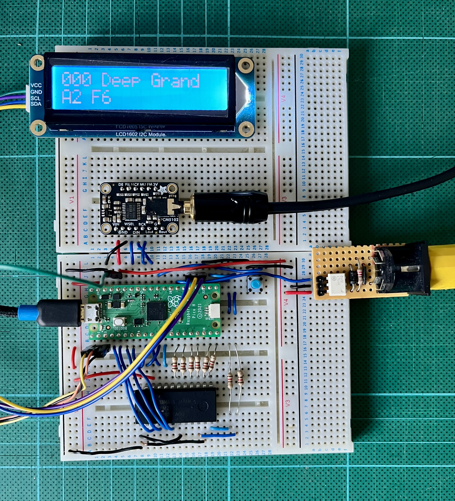

# Hardware config picoX21H

Hardware config to support a MIDI synthesizer with DAC, 16x2 LCD and a physical
Yamaha YM2151 FM synthesis chip.

[Block Diagram](docs/block_diagram.pdf)



[Schematic](docs/schematic.pdf) for the above.

## Config variations

| Config | Supported targets | Description |
|------------|--------|-------------|
| RPIPICO_I2S_DAC | rp2040, rp2350 | Generic I2S DAC |
| RPIPICO_PWM_DAC | rp2040, rp2350 | Pulse Width Modulation DAC |
| RPIPICO_WAVESHARE_REV2_1| rp2040, rp2350 | WAVESHARE I2S DAC |
| NATIVE | native | |

## Pin out

### I2S_DAC
```
                      +-----------+
   (Debug) TX UART <- |  1     40 | <> vbus +5v
                      |  2     39 | <> vsys
               gnd ## |  3     38 | ## gnd
      YM2151_3 /IC <- |  4     37 | <- 3v3-en
      YM2151_4  A0 <- |  5     36 | -> 3v3
      YM2151_5 /WR <- |  6     35 | <- adc-vref
      YM2151_6 /RD <- |  7     34 | -> I2S LRCLK
               gnd ## |  8     33 | ## agnd
     YM2151_24 CLK <- |  9     32 | -> I2S SCLK
YM2151_21 DAC SD   -> | 10     31 | -> I2S SD
YM2151_23 DAC CLK  -> | 11     30 | <- run
YM2151_20 DAC SAM1 -> | 12     29 |    
               gnd ## | 13     28 | ## gnd
      YM2151_18 D7 <> | 14     27 | <- UART RX (MIDI in)
      YM2151_17 D6 <> | 15     26 |    
      YM2151_16 D5 <> | 16     25 | -> I2C SCL (16x2 LCD)
      YM2151_15 D4 <> | 17     24 | -> I2C SDA (16x2 LCD)
               gnd ## | 18     23 | ## gnd
      YM2151_14 D3 <> | 19     22 | <> YM2151_11 D0
      YM2151_13 D2 <> | 20     21 | <> YM2151_12 D1
                      +-----------+
```
### PWM_DAC
```
                      +-----------+
   (Debug) TX UART <- |  1     40 | <> vbus +5v
                      |  2     39 | <> vsys
               gnd ## |  3     38 | ## gnd
      YM2151_3 /IC <- |  4     37 | <- 3v3-en
      YM2151_4  A0 <- |  5     36 | -> 3v3
      YM2151_5 /WR <- |  6     35 | <- adc-vref
      YM2151_6 /RD <- |  7     34 |    
               gnd ## |  8     33 | ## agnd
     YM2151_24 CLK <- |  9     32 |    
YM2151_21 DAC SD   -> | 10     31 | -> PWM (audio out)
YM2151_23 DAC CLK  -> | 11     30 | <- run
YM2151_20 DAC SAM1 -> | 12     29 |    
               gnd ## | 13     28 | ## gnd
      YM2151_18 D7 <> | 14     27 | <- UART RX (MIDI in)
      YM2151_17 D6 <> | 15     26 |    
      YM2151_16 D5 <> | 16     25 | -> I2C SCL (16x2 LCD)
      YM2151_15 D4 <> | 17     24 | -> I2C SDA (16x2 LCD)
               gnd ## | 18     23 | ## gnd
      YM2151_14 D3 <> | 19     22 | <> YM2151_11 D0
      YM2151_13 D2 <> | 20     21 | <> YM2151_12 D1
                      +-----------+
```

### WAVESHARE_REV2_1
```
                      +-----------+
   (Debug) TX UART <- |  1     40 | <> vbus +5v
                      |  2     39 | <> vsys
               gnd ## |  3     38 | ## gnd
      YM2151_3 /IC <- |  4     37 | <- 3v3-en
      YM2151_4  A0 <- |  5     36 | -> 3v3
      YM2151_5 /WR <- |  6     35 | <- adc-vref
      YM2151_6 /RD <- |  7     34 | -> I2S LRCLK
               gnd ## |  8     33 | ## agnd
     YM2151_24 CLK <- |  9     32 | -> I2S SCLK
YM2151_21 DAC SD   -> | 10     31 | -> I2S MCLK
YM2151_23 DAC CLK  -> | 11     30 | <- run
YM2151_20 DAC SAM1 -> | 12     29 | -> I2S SD
               gnd ## | 13     28 | ## gnd
      YM2151_18 D7 <> | 14     27 | <- UART RX (MIDI in)
      YM2151_17 D6 <> | 15     26 |    
      YM2151_16 D5 <> | 16     25 | -> I2C SCL (16x2 LCD)
      YM2151_15 D4 <> | 17     24 | -> I2C SDA (16x2 LCD)
               gnd ## | 18     23 | ## gnd
      YM2151_14 D3 <> | 19     22 | <> YM2151_11 D0
      YM2151_13 D2 <> | 20     21 | <> YM2151_12 D1
                      +-----------+
```
